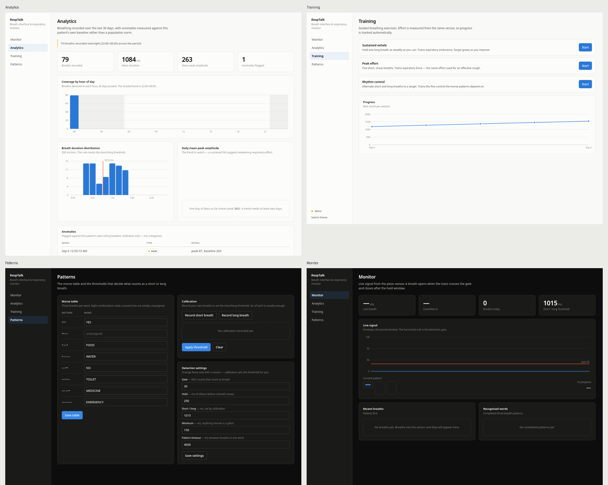
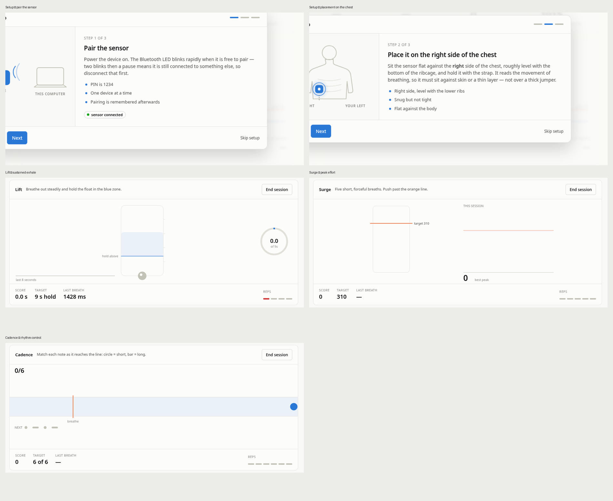

# breath-control-and-paralysis

ESP32 + MPU-6050 rig. The firmware identifies the IMU, configures it and streams
motion over USB serial as CSV; the host script reads, displays and logs it.

## Hardware as tested

| | |
|---|---|
| Board | ESP32-D0WD-V3 (WROOM-32), CP2102 USB bridge, **26 MHz crystal** |
| IMU | MPU-6050 at I2C address `0x68` (WHO_AM_I `0x68`) |
| Port | `/dev/ttyUSB0` @ 115200 |

Wiring: `VCC -> 3V3`, `GND -> GND`, `SDA -> GPIO21`, `SCL -> GPIO22`, `AD0 -> GND`.
Pins live in [firmware/main/mpu.h](firmware/main/mpu.h).

**The 26 MHz crystal matters.** Most ESP32 boards use 40 MHz and ESP-IDF defaults
to that; on this board the mismatch garbles every UART byte the app prints.
`CONFIG_XTAL_FREQ_AUTO=y` in [firmware/sdkconfig.defaults](firmware/sdkconfig.defaults)
detects it at boot. If serial output ever turns to mojibake, check that first.

## Build and flash

```bash
scripts/flash.sh            # build + flash /dev/ttyUSB0
scripts/monitor.sh          # IDF serial monitor (Ctrl-] to exit)
```

Or by hand: `. scripts/env.sh` then `cd firmware && idf.py build flash monitor`.

## Reading the stream

The host script needs `python3.11` — that is the interpreter with pyserial here.

```bash
python3.11 host/read_imu.py                 # live pitch/roll/rate view
python3.11 host/read_imu.py --csv run.csv   # log while viewing
python3.11 host/read_imu.py --raw           # verbatim lines
```

## Wire format

One line per sample, 100 Hz. Data lines start with `D,`; everything else is an
IDF log line, so a reader can key on the prefix.

```
H,millis,ax_g,ay_g,az_g,gx_dps,gy_dps,gz_dps,temp_c
D,148,-1.6426,-0.1421,1.0298,3.08,14.06,-66.60,27.87
```

Ranges: accel ±4 g, gyro ±500 deg/s, DLPF 44 Hz, 200 Hz internal sample rate
decimated to a 100 Hz stream.

## Verified

100.0 Hz sustained, no reboots over a 6 s capture, 1.0 g magnitude at rest.

---

# RespTalk (Arduino Uno + HC-05)

The second rig in this project: three breaths form a Morse-like pattern that
resolves to a word, shown on an OLED and sent over Bluetooth.

## Vocabulary

| Pattern | Word | Pattern | Word |
|---|---|---|---|
| `.-.` | FOOD | `--.` | MEDICINE |
| `.--` | WATER | `...` | YES |
| `---` | EMERGENCY | `-..` | NO |
| `-.-` | TOILET | | |

A breath under 1000 ms is a dot, 1000 ms or over is a dash.

## Bluetooth

HC-05 `00:25:00:00:56:86`, PIN `1234`, SPP on RFCOMM channel 1. Already bonded
and trusted, so reconnecting needs no PIN.

```bash
python3.11 host/bt_read.py            # live stream
python3.11 host/bt_read.py --hex      # hex dump
```

**HC-05 is single-master** — it stays discoverable but refuses all connections
while bonded to another device. `ConnectionAttemptFailed` with no PIN prompt
means something else is holding it.

**Measured wiring note:** this rig's HC-05 RXD is on **hardware serial (D1)**,
not D10/D11 as the original sketch's comment claimed. Everything
`Serial.println()`s therefore reaches the phone/laptop, which is why the stream
carries the full trace and not just the word. `USE_SOFTSERIAL` in the sketch is
`0` for that reason; set it to `1` if you rewire to D10/D11.

## OLED sketch

[arduino/resptalk_oled/resptalk_oled.ino](arduino/resptalk_oled/resptalk_oled.ino)
replaces the 16x2 LCD with an SSD1306 128x64. Needs Adafruit GFX + Adafruit
SSD1306 from Library Manager.

Four screens — see [docs/oled-screens.png](docs/oled-screens.png):

- **Idle** — a scrolling respiration trace, so the device reads as alive.
  Decorative: the comparators give two digital edges, not an analog waveform.
- **Measuring** — a live meter with the dot/dash threshold marked, so the user
  can see which symbol they are producing *before* the breath ends. The
  original LCD version gave no feedback until after the fact.
- **Recognised** — icon plus word, with a countdown bar for the idle timeout.
- **Unrecognised** — the pattern that was actually entered, drawn as large
  dot/dash glyphs so the mistake is visible and learnable.

Icons are drawn with GFX primitives rather than bitmaps, so they cost no RAM
and are easy to edit.

### RAM is the constraint

Verified with `arduino-cli compile --fqbn arduino:avr:uno`:

```
Program storage: 19842 bytes (61%)
Global variables:  733 bytes (35%)
```

That 733 figure is **misleading**. Adafruit_SSD1306 `malloc`s its 1024-byte
framebuffer at runtime (`Adafruit_SSD1306.cpp:499`), so real usage is
733 + 1024 = 1757 of 2048, leaving ~291 bytes of stack. Dropping the unused
`SoftwareSerial` bought back ~117 of those. If you add features, watch this
number — running out of stack on an AVR shows up as silent corruption, not a
clean error.

### Two behaviour changes from the LCD version

- The buzzer was held HIGH for the whole 5 s idle timeout. It is now a 150 ms
  chirp (`BEEP_MS`).
- `String` is gone in favour of char arrays and an enum, to save RAM.

### Previewing screen changes

[tools/render_screens.py](tools/render_screens.py) reimplements the GFX
primitives in Python, driven by the real 5x7 font table from the installed
library, and renders the screens to a PNG. Edit the sketch, mirror the change
in the renderer, and see the layout without touching hardware.

```bash
python3.11 tools/render_screens.py
```

---

# Web dashboard

A local web app: reads the Arduino's raw ADC stream over Bluetooth, detects
breaths, stores them, and serves a dashboard at `http://127.0.0.1:8000`.

```bash
python3.11 web/server.py           # connect to the HC-05
python3.11 web/server.py --demo    # synthetic data, no hardware needed
```

Needs `uvicorn` (installed). No other dependencies — the charts are hand-rolled
SVG, so it works offline with no CDN. Flash
[arduino/resptalk_raw](arduino/resptalk_raw/resptalk_raw.ino) or the main sketch;
both emit `ADC:<n>`, which is what the server parses.



## Views

**Monitor** — live envelope with the detection gate drawn on it, the pattern
filling in slot by slot, elapsed time on the breath in progress, and recent
breaths and recognised words.

**Analytics** — coverage by hour of day with the 22:00–06:00 band shaded,
duration distribution against the short/long threshold, daily mean peak
amplitude, and flagged anomalies. Anomalies are measured against **this
patient's own rolling baseline**, not a population norm: a pause is a gap
beyond mean + 3 SD, a weak breath is a peak below mean − 1.5 SD.

**Training** — three canvas games, all driven by the live sensor so a score is
a real measurement rather than a proxy:

- **Lift** — an incentive spirometer. Airflow raises a float; hold it in the
  target zone. This is the standard bedside exercise against atelectasis, and
  the target grows as you improve.
- **Surge** — peak expiratory effort against a moving target line. The same
  push an effective cough depends on.
- **Cadence** — notes flow toward a line; breathe short or long to match.
  Trains the fine control the morse patterns need.

Each exercise is measured in a different unit (seconds, ADC peak, hits), so the
progress card shows **three separate charts**. Putting them on one axis would
invent a relationship that is not there.



## Setup guide

A three-step guided flow runs on first visit and is reachable any time from
**Setup guide** in the sidebar: pair the sensor, place it, calibrate.

The placement step is animated, because *"right side of the chest"* is
ambiguous in words and getting it wrong costs the signal. The figure faces the
viewer, so the subject's right is drawn on the viewer's left — the **YOUR
RIGHT / YOUR LEFT** markers make that explicit rather than leaving it to be
inferred. The sensor is shown level with the lower ribs, which is what the
instructions say.

All animation respects `prefers-reduced-motion`.

Deep links, useful for pointing a carer straight at the instructions:

```
http://127.0.0.1:8000/?obstep=1        # placement instructions
http://127.0.0.1:8000/?game=sustained  # jump into a game
http://127.0.0.1:8000/?theme=light     # force a theme
```

**Patterns** — the full eight-combination morse table, editable and saved to
the database; calibration by recording your own breaths, with the threshold
derived from the gap between the two classes; and the detection settings.

## Timing

Breath durations are measured from **wall-clock arrival time**, not a sample
count. The Arduino's nominal 100 Hz is not trustworthy — recordings measured
210–417 Hz, because `SoftwareSerial` blocks interrupts and starves `millis()`.
Bluetooth jitter is ~10–50 ms, which on a ~1 s breath is a few percent;
assuming the wrong sample rate was a factor of 2–4.

## The limit worth knowing

**Overnight monitoring does not work with the current sensor.** A piezo at a
mouthpiece only registers breath directed into it — across 20 calibration
recordings, tested at gates down to 5, passive breathing never appeared, and
the signal reads exactly 0 for 68% of all recorded time. Night coverage needs a
worn sensor: a chest or abdomen belt, or the MPU-6050 on the sternum. The
Analytics view says so explicitly when the overnight band is empty rather than
implying breathing stopped.

Not a medical device. The anomaly flags are indicative and belong in a
conversation with a clinician, not in a diagnosis.
